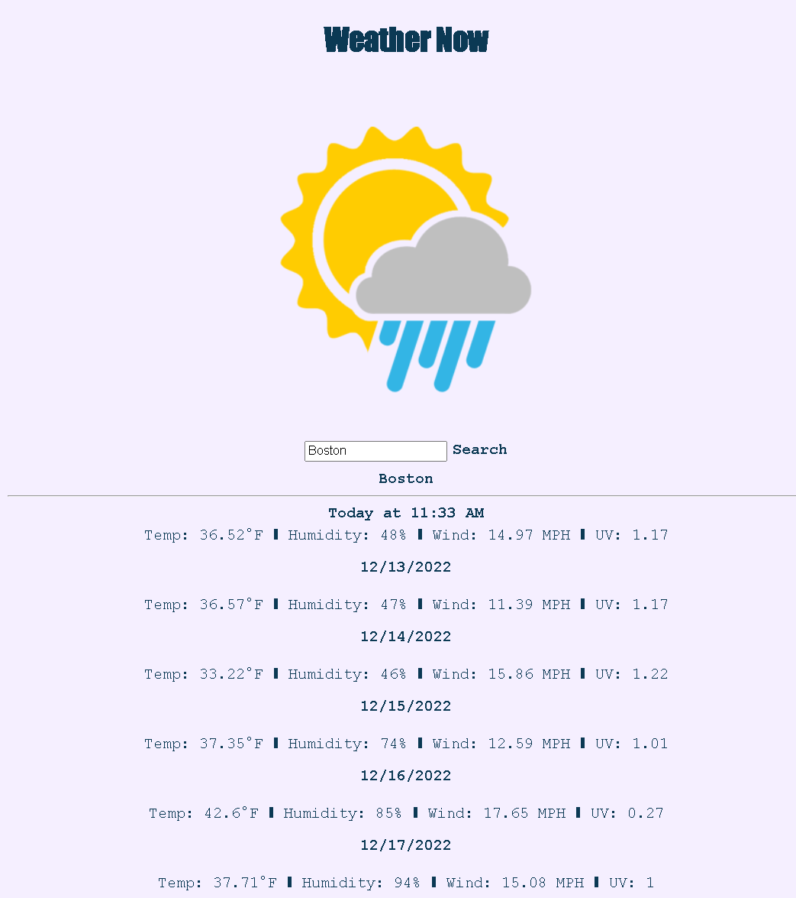

# Weather Now

## Deployed Link
https://daynelalmond.github.io/weather_dashboard/

## Screenshot

## Description
Weather Now is an application to find and view the current weather of your search.
Simply start by typing the name of the city in the provided text form, click on the "Search" button, and preview a list of it's weather properties.

## Features
A minimalistic layout mobile friendly. Includes formatted dates with moment js.
